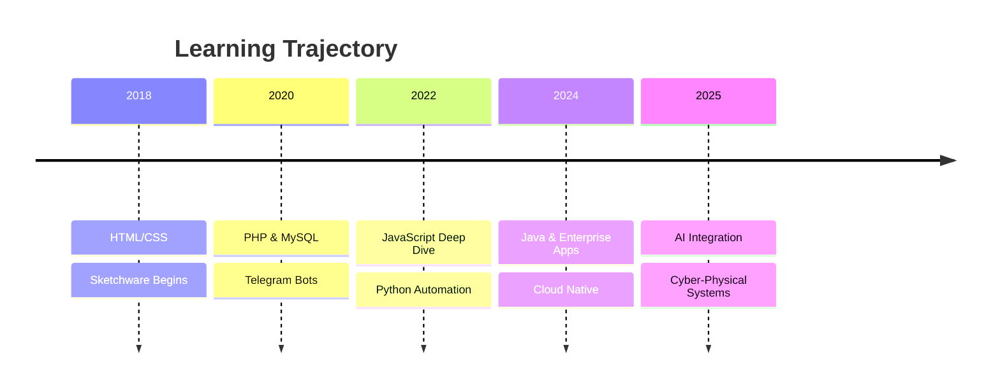

# 💀 𝙺𝙻𝟸𝟿𝚁𝙾𝚈𝙰𝙻

<p align="center">
  +CYBER_ARCHITECT_%7C_DEVELOPER;>+FULL+STACK+%2B+EMBEDDED+MINDSET;>+BREAKING+BOUNDARIES+%7C+KL29ROYAL" alt="Typing SVG" />
</p>

<p align="center">
  
</p>

---

### ⚡ `$ whoami`

```bash
> sudo systemctl start kl29royal.profile
```

```yaml
LOCATION:       Kayamkulam, India 🇮🇳
DEVICE:         HONOR X7c 5G & REALME RMX2170
ROLE:           Full Stack Architect | Automation Hacker
STATUS:         Building the future, one commit at a time.
MISSION:        Transform ideas into cyber-reality.
```

---

🧠 $ cyber_journey --timeline



---

🧬 $ tech_stack --matrix

FRONTEND BACKEND MOBILE TOOLS & DEVOPS
⚛️ React / Next 🐘 PHP (Laravel) 📱 Sketchware Pro 🐧 Linux (Arch/Kali)
🎨 Tailwind / CSS3 🐍 Python (FastAPI) 🧩 Android Studio 🐳 Docker / K8s
📜 TypeScript / JS ☕ Java (Spring) 🔧 React Native 🤖 Telegram API
🌐 HTML5 / Canvas 🔌 Node.js / Express 📲 Flutter (basic) 🧠 Git / GitHub Actions

---

📡 $ featured_projects

<table>
  <tr>
    <td width="50%">
      <h3 align="center">🤖 TELEGRAM AUTOMATION SUITE</h3>
      <p align="center">High-performance bots + scrapers + cloud panels. Used by 5K+ users.</p>
      <p align="center"><code>Python • Telethon • MongoDB • Asyncio</code></p>
    </td>
    <td width="50%">
      <h3 align="center">⚡ PHP CYBER PANELS</h3>
      <p align="center">Modular admin dashboards & API gateways with neon UI.</p>
      <p align="center"><code>PHP 8 • MySQL • Tailwind • Alpine.js</code></p>
    </td>
  </tr>
  <tr>
    <td width="50%">
      <h3 align="center">📱 SKETCHWARE APPS</h3>
      <p align="center">Utility apps + game mods published on Play Store (beta).</p>
      <p align="center"><code>Java • XML • Firebase • Ads Integration</code></p>
    </td>
    <td width="50%">
      <h3 align="center">🌐 PORTFOLIO 4.0</h3>
      <p align="center">Glassmorphism + Three.js interactive cyber showroom.</p>
      <p align="center"><code>Next.js • Framer Motion • WebGL</code></p>
    </td>
  </tr>
</table>

---

📈 $ gh_stats --hyperdrive

<p align="center">
  
  
</p>

<p align="center">
  
</p>

---

🐍 $ contribution_snake --eat

<picture>
  <source media="(prefers-color-scheme: dark)" srcset="https://raw.githubusercontent.com/KL29ROYAL/KL29ROYAL/output/github-snake-dark.svg" />
  <source media="(prefers-color-scheme: light)" srcset="https://raw.githubusercontent.com/KL29ROYAL/KL29ROYAL/output/github-snake.svg" />
  
</picture>

---

🌐 $ social_grid

<p align="center">
  <a href="https://youtube.com/@KL29ROYAL" target="_blank">
    
  </a>
  <a href="https://t.me/KL29ROYAL" target="_blank">
    
  </a>
  <a href="https://github.com/KL29ROYAL" target="_blank">
    
  </a>
</p>

---

<p align="center">
  
</p>

###Iam very Happy to Published this Project 🥰

